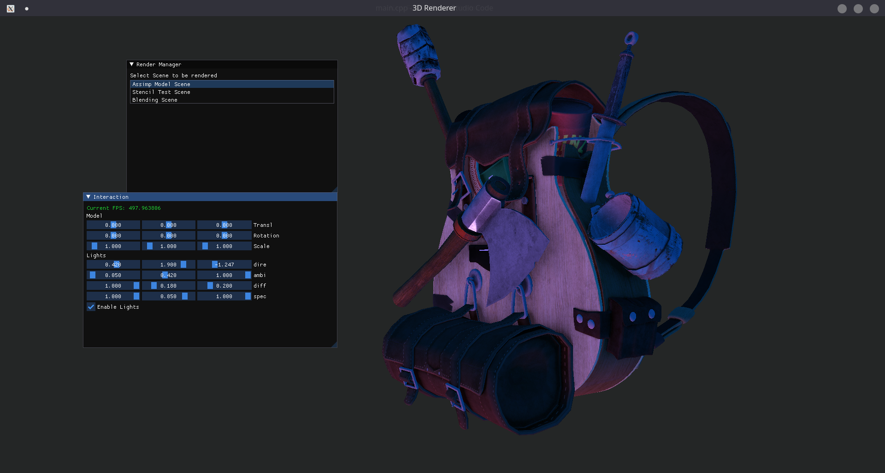
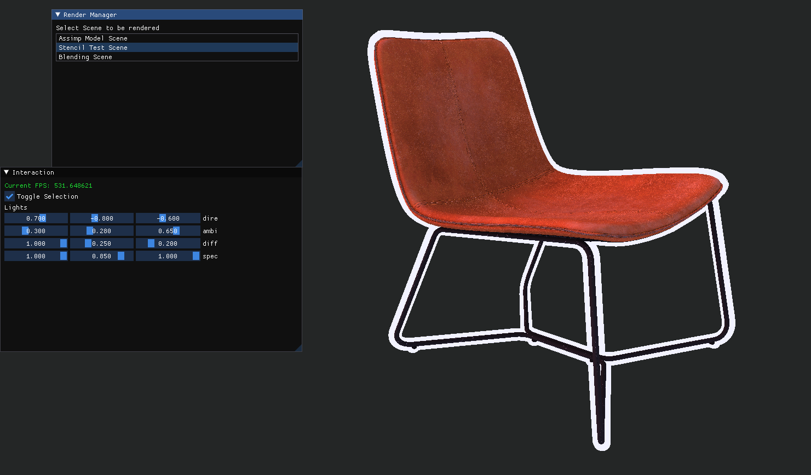
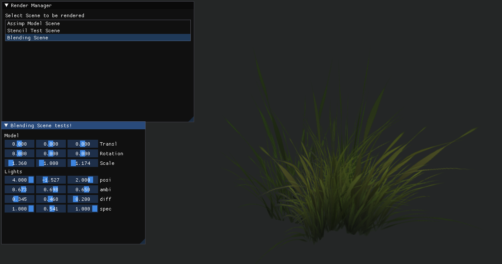

This is my toy OpenGL Engine that was written for learning purposes. Initially this is a training project that is aimed at gaining more experience in graphics programming.

## External Dependencies
- [assimp](https://github.com/assimp/assimp)
- [ImGui](https://github.com/ocornut/imgui)
- [GLFW](https://github.com/glfw/glfw)
- [glew](https://github.com/nigels-com/glew)
- [glm](https://github.com/g-truc/glm)

## Rendering Features

- Basic Phong Lighting support (Directional, Spot, Point)
- Fast GLSL Shader parsing (Unfinished)
- Model loading (temporarily done by Assimp)
- Scene buffer, that allows switching between scenes
- Responsive Window object (GLFW)
- OpenGL wrappers (Unfinished)

## Screenshots

          

<i>Model Scene with lights, usage of specular and diffuse textures</i>

          

<i>Model's outline using stencil buffer</i>

<i>PNG Texture2D blending using OpenGL function calls</i>

